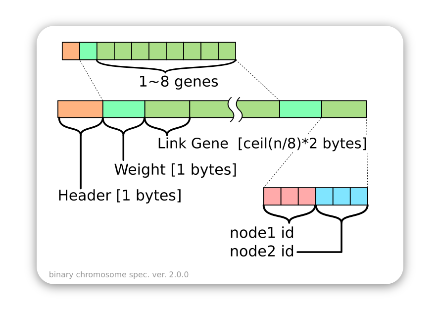

BNN Tools
===

This is a tool package of Genetic Algorithm  for my machine learning project which are using BNN (Boolean Neural Network).

Definition
---

The binary chromosome defined as shown below:



The length of node id (address), the variable n, are defined by addressing space, which the first byte in the file/string.


Usage
---
### Random Generator
To create randomly chromosome.
Allowed options:
  --help                produce help message
  --address arg         length of addressing space
  --gene arg            how many genes will generated

```shell
./generator --address 12 --gene 100 > test_gene
```

### Decoder
To parse gene and convert to Json.
```shell
./decoder --input-file test_gene > test_gene.json
```

### Mutator
Creating chromosome of next generaion by mutated source from file.
Allowed options:
  --help                produce help message
  --input-file arg      the chromosome file
  --mutated-rate arg    probability of mutate happened.

```shell
./mutator --input-file test_gene --mutated-rate 0.1 > test_gene_mutated
```